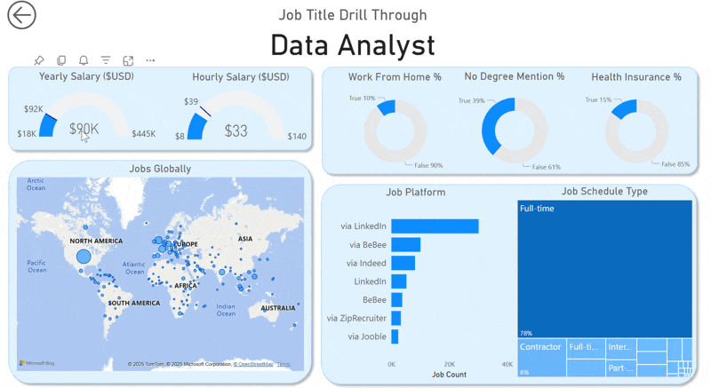

# Data Jobs Dashboard w/ Power BI

## Introduction

Navigating the data job market can feel like a maze with information scattered everywhere. This dashboard was created for **Job Seekers, Job Transitioners, and Job Swappers** to cut through the clutter. Using a real-world dataset of 2024 data science job postings — rich with details on titles, salaries, and locations — this project offers an interface to quickly explore crucial market trends and compensation insights.

Two versions of the report are included below — **Version 2.0 is current and recommended**; Version 1.0 is kept for reference.

---

## Version 2.0 — Current (Single-Page Focus)

### Dashboard File

You can find the file for the dashboard here: [`Data_Jobs_Dashboard_2.0.pbix`](Data_Jobs_Dashboard_2.0.pbix).

This iteration consolidates the report into a **single, focused page**, giving job seekers the most critical market insights at their fingertips.

This page acts as your concise mission control for the data job market. It showcases key performance indicators (KPIs) like **Job Count, Skills Per Job, Median Yearly Salary, and Median Hourly Salary**. You can also quickly see **Skill Popularity** (by job percent or count) and compare **Salaries across different Job Titles**, all designed for an efficient overview.

### Skills Showcased

- **🎨 Dashboard Design:** Crafting an intuitive and visually appealing report layout.
- **⚙️ Power Query ETL:** Performing data cleaning, shaping, and transformation.
- **🔗 Data Modeling:** Building efficient data models with relationships (Star Schema principles).
- **🧮 DAX Fundamentals:** Creating calculations and aggregations to derive key insights.
- **📊 Visualizations Utilized:**
  - **📈 Core Charts:** Column, Bar, Line, and Area charts for comparisons and trends.
  - **🗺️ Map Charts:** For displaying geospatial data.
  - **🔢 Cards:** To highlight key performance indicators.
  - **📋 Tables:** For presenting detailed, tabular information.
  - **🎨 Chart Variety:** Selecting from common and uncommon chart types for effective storytelling.
- **🖱️ Interactive Features:**
  - **🎚️ Slicers:** Enabling dynamic, user-driven data filtering.
  - **🔘 Buttons & Bookmarks:** For streamlined navigation and managing report views (including Drill-Through).

---

## Version 1.0 — Prior Iteration (Archived)

### Dashboard File

You can find the file for the dashboard here: [`Data_Jobs_Dashboard.pbix`](Assets/Data_Jobs_Dashboard.pbix) _(archived in the Assets folder)_.

This report is split into two distinct pages: a high-level summary and a detailed, drill-through analysis.

**Page 1 — High-Level Market View**

Mission control for the data job market — total job count, median salaries, and top job titles at a glance.

**Page 2 — Job Title Drill Through**

Deep-dive view: salary ranges, work-from-home stats, top hiring platforms, and a global map of job locations for a selected job title.

### Skills Showcased

- **⚙️ Data Transformation (ETL) with Power Query:** Cleaned, shaped, and prepared raw data — handling blanks, changing data types, creating new columns.
- **🧮 Implicit Measures:** `Median Yearly Salary`, `Job Count`.
- **📊 Core Charts:** Column, Bar, Line, and Area charts.
- **🗺️ Geospatial Analysis:** Map charts for global job distribution.
- **🔢 KPI Indicators & Tables:** Cards for metrics, Tables for granular sortable data.
- **🖱️ Interactive Reporting:** Slicers, Buttons & Bookmarks, Drill-Through.

---

## Conclusion

This project shows how Power BI can transform raw job posting data into a powerful tool for career analysis — and how a report evolves from a detailed multi-page view (v1.0) into a streamlined, single-page decision tool (v2.0). It empowers **Job Seekers, Job Transitioners, and Job Swappers** to filter and explore essential market insights efficiently, helping them make informed decisions about their next career move.
